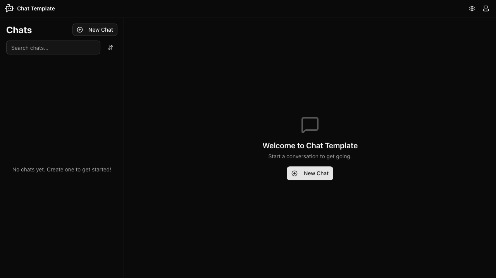
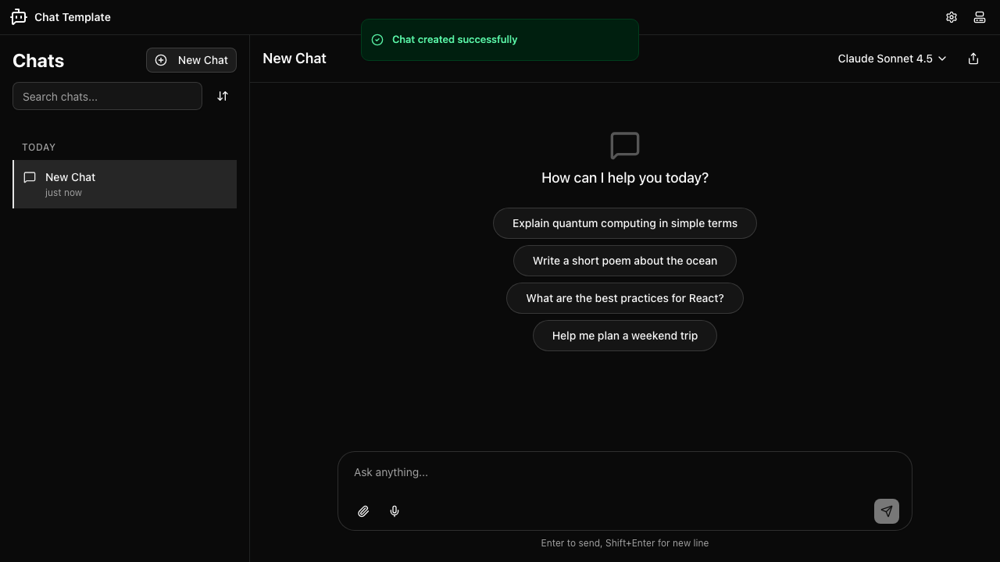
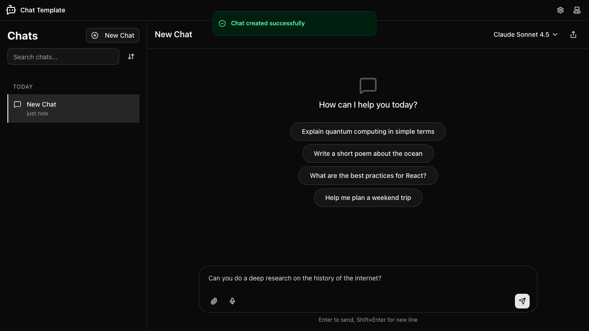
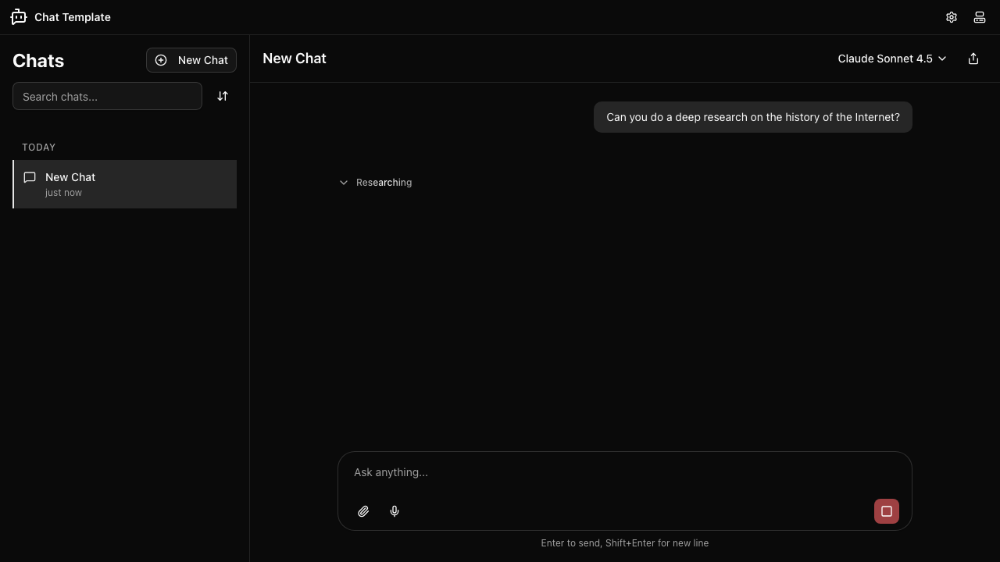
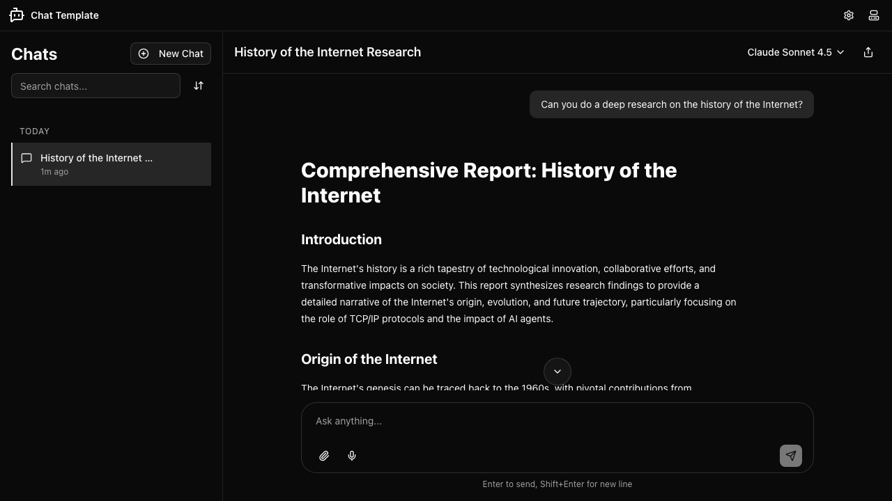
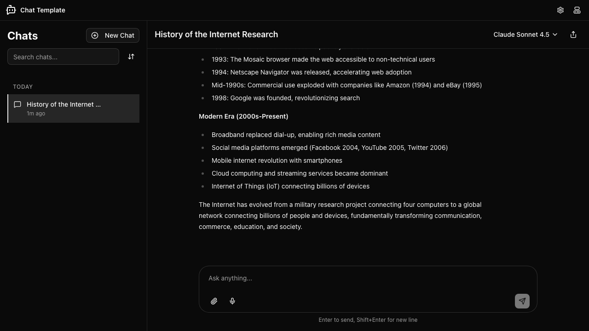

# Deep Research

Chat Template includes a built-in deep research capability. When you ask the AI to research a topic, it searches the web, evaluates sources, and extracts insights — all automatically — before writing a comprehensive report. This guide walks you through starting a deep research query, watching the research progress, and reading the finished report.

## Step 1: Open the App

Open Chat Template in your browser. The app signs you in automatically — you do not need an account or API key.

The left sidebar shows your chat list and a **New Chat** button. The main area displays the "Welcome to Chat Template" message with a second **New Chat** button. The header contains the app logo, a settings button, and a theme toggle.

## Step 2: Create a New Chat

Click the **New Chat** button — either in the sidebar or in the welcome area. The app creates a fresh chat and opens it immediately.

The chat area shows four suggestion chips in the centre: "Explain quantum computing in simple terms", "Write a short poem about the ocean", "What are the best practices for React?", and "Help me plan a weekend trip". The sidebar lists the new chat under a "Today" heading, and the current AI model is shown in the top-right corner.

> **Tip:** You can create as many chats as you like. Each one keeps its own independent history, so your research results are always easy to find later.

## Step 3: Type a Deep Research Prompt

Click the **Ask anything...** input at the bottom of the chat view and type your research question. Ask the AI to "do a deep research on" the topic you want to explore.

You can phrase the request naturally — for example:

- "Can you do a deep research on the history of the Internet?"
- "Do a deep research on climate change mitigation strategies."
- "Please do a deep research on the development of mRNA vaccines."

Once you have typed your prompt, press **Enter** to send it (or click the send button in the bottom-right corner of the input area).

> **Tip:** To insert a line break in your message without sending it, press **Shift+Enter**.

## Step 4: Watch the Research in Progress

After you send the prompt, the AI begins a multi-step research process. You will see a **Researching** indicator appear below your message while the work is underway.

During this phase the AI is performing several tasks in sequence:

- **Searching the web** — running targeted queries to find relevant sources
- **Evaluating results** — checking whether each source is useful for your question
- **Extracting insights** — pulling out the key facts and learnings

You can click the **Researching** row to expand it and see each step as it completes. A green check mark appears next to each finished step. If you need to stop the process at any point, click the red **stop button** (square icon) in the input area.

> **Note:** Deep research queries take longer than regular chat messages because the AI searches and reads multiple web pages before writing its report. Expect the process to take between one and two minutes depending on the topic.

## Step 5: Read the Completed Report

Once the research is finished, the AI writes a comprehensive report and displays it in the chat. The chat title updates automatically to describe what was researched.

The report is structured with clear headings and sections so you can navigate it easily. Scroll down to read the full content.

After the report is displayed, the input area becomes active again and you can continue the conversation. You might ask follow-up questions, request a summary of a specific section, or ask the AI to compare findings with another topic.

> **Tip:** The chat title in the sidebar and at the top of the view reflects the research topic, so you can easily return to this conversation later.
