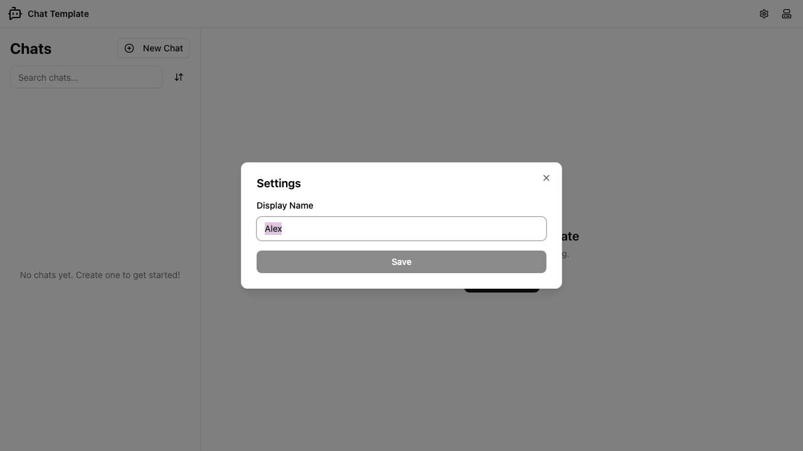
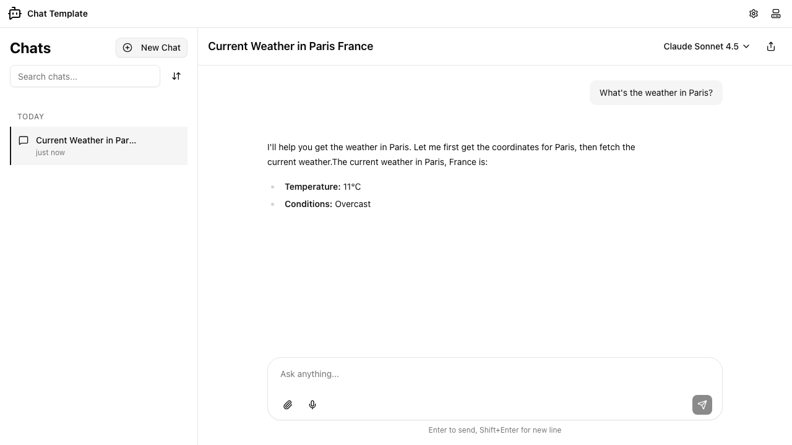

# Getting Started

Chat Template is an AI chat application with built-in tools that runs in your browser. You sign in automatically — no account creation or API key required. This guide walks you through the complete experience: opening the app, setting your display name, starting a chat, and trying the built-in weather tool.

## Step 1: Open the App

When you open the app, it signs you in automatically in the background. You will see the welcome screen within a few seconds.

The left sidebar shows your chat list (currently empty) along with a **New Chat** button and a search box. The main area displays a "Welcome to Chat Template" message and a second **New Chat** button. The header at the top contains the app logo, a settings button (gear icon), and a theme toggle.

## Step 2: Set Your Display Name (Optional)

You can give yourself a display name so the app knows what to call you.

1. Click the **gear icon** in the top-right corner of the header to open the Settings dialog.

2. Type your name into the **Display Name** field.
3. Click **Save**. The dialog closes and your name is stored.

> **Tip:** The Save button is only active when you have made a change. If the button appears greyed out, make sure you have typed something different from the current value.

## Step 3: Create a New Chat

Click the **New Chat** button — either in the sidebar or the main welcome area. The app creates a new chat and opens it immediately.

The chat opens in the main area with four suggestion chips in the centre: "Explain quantum computing in simple terms", "Write a short poem about the ocean", "What are the best practices for React?", and "Help me plan a weekend trip". Click any chip to insert that text into the message input ready to send.

The sidebar now lists the new chat under a "Today" heading. The current AI model ("Claude Sonnet 4.5") is shown in the top-right corner of the chat view.

> **Tip:** You can create as many chats as you like. Each chat keeps its own independent message history.

## Step 4: Send a Message

Type your question or prompt into the input box at the bottom of the chat view.

You can send the message in two ways:

- Press **Enter** to send immediately.
- Click the **send button** (arrow icon) in the bottom-right corner of the input area.

> **Tip:** To write a multi-line message, press **Shift+Enter** to insert a line break without sending.

## Step 5: Try the Weather Tool

The app includes a built-in weather tool. Ask the AI about the weather in any city and it will look up live data for you.

Type something like "What's the weather in Paris?" and press **Enter**.

The AI fetches current weather data and replies with the temperature and conditions for that city. The chat title updates automatically to reflect what you asked about.

You can continue the conversation by typing another message. Ask about a different city, or ask the AI to compare conditions in two places.

## Choosing a Different AI Model

By default, the app uses Claude Sonnet 4.5. You can switch to a different model at any time using the model selector in the top-right corner of the chat view. Click the model name to open a dropdown and choose another option. The selected model applies to all subsequent messages in that chat session.
