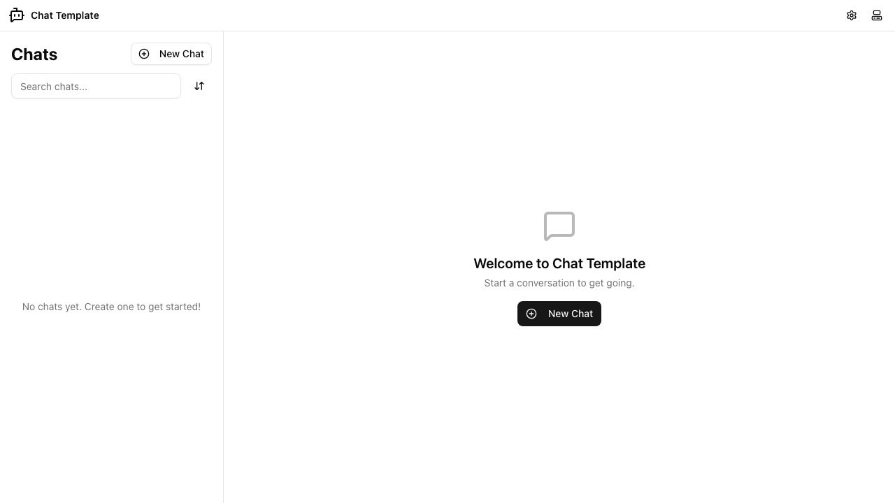
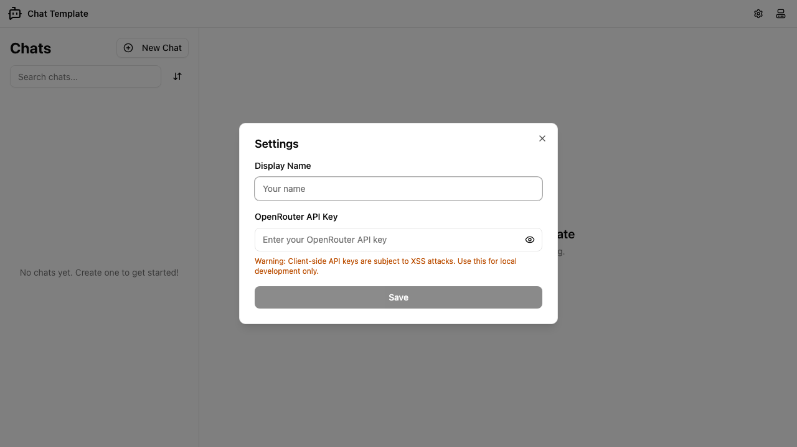
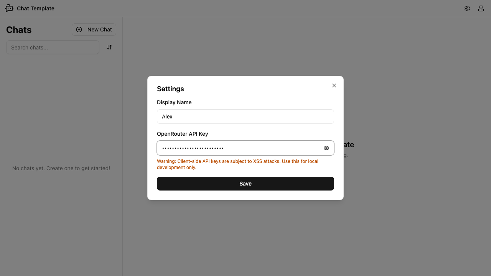
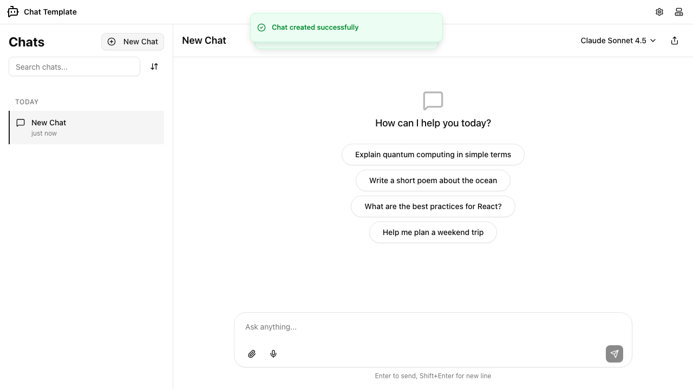
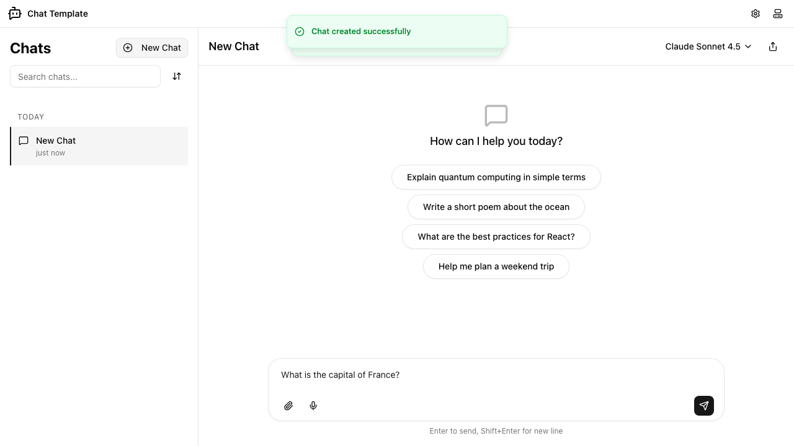
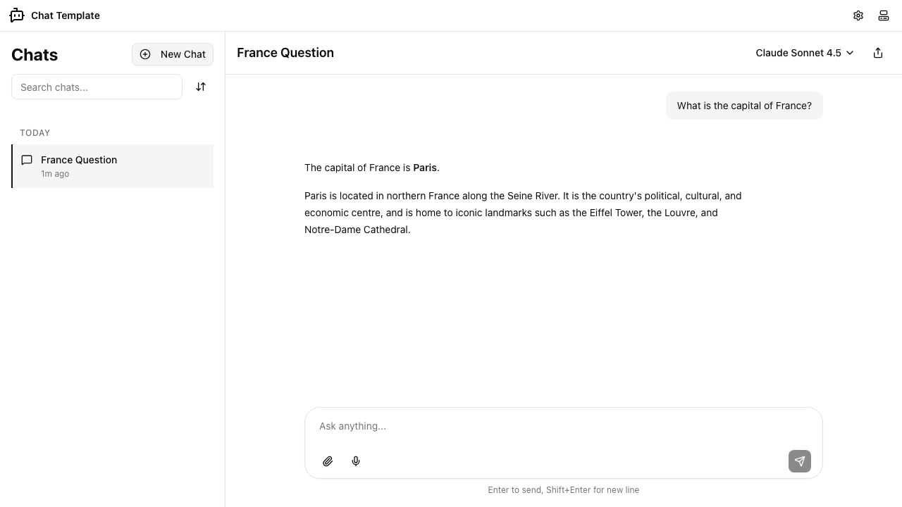

# Getting Started

Chat Template is a "bring your own API key" AI chat app that runs entirely in your browser. Your conversations and settings stay on your device — nothing is sent to a backend. This guide walks you through the complete first-time setup: adding your API key, creating a chat, and sending your first message.

## Step 1: Open the App

When you open the app for the first time, you will see the welcome screen. The left sidebar shows the chat list (currently empty), and the main area invites you to start a conversation.

The header at the top contains the app logo, a settings button (gear icon), and a theme toggle. The sidebar shows a "New Chat" button and a search box that you will use once you have chats.

## Step 2: Add Your OpenRouter API Key

Chat Template does not come with a built-in AI key. You need to provide your own [OpenRouter](https://openrouter.ai) API key before the app can send messages to any AI model.

1. Click the gear icon in the top-right corner of the header to open the Settings dialog.

2. Enter a **Display Name** — this is how you will be identified in the conversation view.
3. Paste your **OpenRouter API Key** into the second field. The key is masked by default; click the eye icon on the right to reveal it if you need to verify it.

> **Note:** The amber warning below the key field is a reminder that client-side API keys can be exposed to browser extensions and other scripts running on the same page. Use this app in a trusted environment and avoid storing high-credit keys here.

4. Click **Save**. The dialog closes and your settings are stored locally in your browser.

## Step 3: Create a New Chat

With your API key saved, you are ready to start a conversation.

Click the **New Chat** button in the top-right area of the sidebar. The app creates a new chat immediately and navigates to it.

The new chat opens in the main area. You will see four suggestion prompts in the centre of the screen — clicking any of them inserts that text into the message input so you can send it with one more click.

The sidebar now lists your new chat under a "Today" heading, and the chat title ("New Chat") appears in the main panel header.

> **Tip:** You can create as many chats as you like. Each chat keeps its own independent message history.

## Step 4: Send a Message

Type your question or prompt into the input box at the bottom of the chat view.

You can send the message in two ways:

- Press **Enter** to send immediately.
- Click the **send button** (arrow icon) in the bottom-right corner of the input area.

> **Tip:** If you need to write a multi-line message, press **Shift+Enter** to insert a line break without sending.

Once sent, the AI model begins generating a response. A "Thinking" indicator appears while the response streams in. When the response is complete, both your message and the AI's reply appear in the conversation.

Your message appears on the right side of the conversation. The AI's response appears on the left, with any markdown — such as **bold text** — rendered inline.

You can continue the conversation by typing another message in the input box. The model remembers the full context of the current chat.

## Choosing a Different AI Model

By default, the app uses Claude Sonnet 4.5. You can switch to a different model at any time using the model selector in the top-right corner of the chat view. Click the model name to open a dropdown and choose another option. The selected model applies to all subsequent messages in that chat session.

## What's Stored Where

- **Settings** (display name and API key) are saved in your browser's `localStorage`. They persist across sessions until you clear browser data.
- **Chats and messages** are saved in your browser's IndexedDB database. They also persist across sessions and are never sent to any server.
